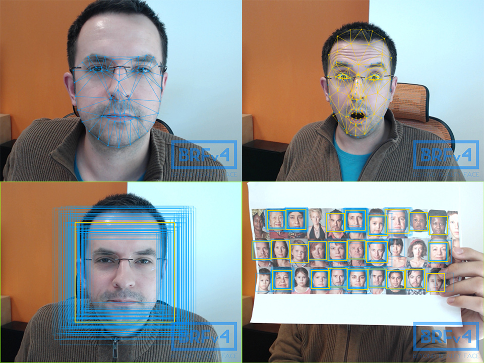

# Beyond Reality Face SDK - v4.0.0 (BRFv4) - Readme

### What is BRFv4?

It is a real time face detection and tracking SDK. You put in image data (camera stream or single picture) and it outputs facial data.



### Ready to try!

Read the EULA (eula.txt) carefully before using the SDK. Once you decide to use BRFv4 commercially, you will get a 
separate license agreement, that you must agree to. You can try the SDK free of charge to evaluate if it fits your projects 
needs. Once you decided to use BRFv4 in your project, please contact us for a commercial license:

+ http://www.tastenkunst.com/#/contact

### Visit us online.

+ [Github](https://github.com/Tastenkunst)
+ [Demo](https://tastenkunst.github.io/brfv4_javascript_examples/)
+ [Docs / API](https://tastenkunst.github.io/brfv4_docs/)
+ [What can I do with it?](https://tastenkunst.github.io/brfv4_docs/what_can_i_do_with_it.html)
+ [Website](https://www.beyond-reality-face.com)
+ [Facebook](https://www.facebook.com/BeyondRealityFace)
+ [Twitter](https://twitter.com/tastenkunst)

### Getting started.

To test BRFv4 simply visit the Javascript demo site:

+ https://tastenkunst.github.io/brfv4_javascript_examples/

This page also includes all available packages for download.

### Which platforms does it support?

#### HTML5/Browser – Javascript (works in Chrome/Firefox/Edge/Opera/Safari 11)
Run the index.html on a local server.

#### iOS - ObjectiveC/C++
Open the Xcode project. Attach your iOS device and run the example app on your device.

#### Android - Java 
Open the Android Studio project. Attach your Android device and run the example app on your device.

#### macOS - C++ utilizing OpenCV for camera access and drawing
Have [OpenCV](http://opencv.org/) brewed (opencv3) on your system. Open the Xcode project and just run it on your Mac.

#### Windows - C++ utilizing OpenCV for camera access and drawing
Good luck in trying to compile [OpenCV](http://opencv.org/) for your Windows. Update the Visual Studio (2017) project properties that mention 
OpenCV. Then run the Release x64 target. Fingers crossed!

#### Adobe AIR - Actionscript 3 on Windows, macOS, iOS and Android 
Use your preferred IDE. Add the src folder and the ANE itself to your class path and run the example class on your 
desired device (not in a simulator). Unfortunately we had to discontinue Flash Player (SWF in browser) support.

### Technical overview

BRFv4 comes with the following components:

+ face detection	- Finds faces (rectangles) in an image/camera stream
+ face tracking		- Finds 68 facial landmarks/features
+ point tracking	- Tracks points in a webcam stream

All available packages have roughly the same content and come with a set of examples to show SDK use cases.

### What image size does BRFv4 need?

You can input any image size.

Internally BRFv4 uses a DYNx480 (landscape) or 480xDYN (portrait) image for the analysis. So 480px is the base size that every other input size get's scaled to, eg.

landscape:

+  640 x  480 -> 640 x 480 // fastest, no scaling
+ 1280 x  720 -> 854 x 480
+ 1920 x 1080 -> 854 x 480

portrait:

+  480 x  640 -> 480 x 640 // fastest, no scaling
+  720 x 1280 -> 480 x 854
+ 1080 x 1920 -> 480 x 854

BRFv4 scales the results up again, so you don't have to do that yourself anymore.
All parameters named *size or *width are pixel values based on the actual image size.
eg. telling BRF what face sizes to initially detect:

```markdown
brfManager.setFaceDetectionParams(int minFaceSize, int maxFaceSize, int stepSize, int minMergeNeighbors);
```
If you work with a 640x480 camera stream, it would be something like this:
```markdown
brfManager.setFaceDetectionParams(144, 432, 12, 8);
```
Where as if you work with a 1280x720 camera stream, you will need something like this:
```markdown
brfManager.setFaceDetectionParams(216, 648, 12, 8);
```
In the examples we generalize it a bit:
```javascript
// We have either a landscape area (desktop), then choose height or
// we have a portrait area (mobile), then choose width as max face size.

var maxFaceSize = _faceDetectionRoi.height;

if(_faceDetectionRoi.width < _faceDetectionRoi.height) {
 maxFaceSize = _faceDetectionRoi.width;
}

brfManager.setFaceDetectionParams(maxFaceSize * 0.30, maxFaceSize * 0.90, 12, 8);
```
More on that in the API, see link above.

### Release notes

v4.0.0 - 20th June 2017

It's done! After over a year of development Tastenkunst is proud to announce the release of BRFv4.

+ Changed: Completely rewritten the C++ core: image handling, face detection and tracking algorithms etc.
+ Changed: Image data can now be of any site. BRFv4 will handle the scaling internally.
+ Changed: Point tracking and face tracking can now be done simultaneously.
+ Changed: Face tracking algorithm changed from ASM to ERT. This comes with an increased file size though (For JS up from 2MB to 10MB)
+ Added: Multi face tracking. It is now possible to track more than one face.
+ Added: Example project for native Android (Java, Android Studio project)
+ Added: Example project for macOS (C++, Xcode project, needs brewed OpenCV for camera handling and drawing)
+ Added: Example project for Windows (C++, Visual Studio 2017 project, needs OpenCV for camera handling and drawing)
+ Added: Adobe AIR native extension now supports Windows, macOS, iOS and Android.
+ Removed: Support for Flash Player (SWF in Browser).

### Licenses

Used Haar Cascade: haarcascade_frontalface_default.xml
```
<!--
    Stump-based 24x24 discrete(?) adaboost frontal face detector.
    Created by Rainer Lienhart.

////////////////////////////////////////////////////////////////////////////////////////

  IMPORTANT: READ BEFORE DOWNLOADING, COPYING, INSTALLING OR USING.

  By downloading, copying, installing or using the software you agree to this license.
  If you do not agree to this license, do not download, install,
  copy or use the software.


                        Intel License Agreement
                For Open Source Computer Vision Library

 Copyright (C) 2000, Intel Corporation, all rights reserved.
 Third party copyrights are property of their respective owners.

 Redistribution and use in source and binary forms, with or without modification,
 are permitted provided that the following conditions are met:

   * Redistribution's of source code must retain the above copyright notice,
     this list of conditions and the following disclaimer.

   * Redistribution's in binary form must reproduce the above copyright notice,
     this list of conditions and the following disclaimer in the documentation
     and/or other materials provided with the distribution.

   * The name of Intel Corporation may not be used to endorse or promote products
     derived from this software without specific prior written permission.

 This software is provided by the copyright holders and contributors "as is" and
 any express or implied warranties, including, but not limited to, the implied
 warranties of merchantability and fitness for a particular purpose are disclaimed.
 In no event shall the Intel Corporation or contributors be liable for any direct,
 indirect, incidental, special, exemplary, or consequential damages
 (including, but not limited to, procurement of substitute goods or services;
 loss of use, data, or profits; or business interruption) however caused
 and on any theory of liability, whether in contract, strict liability,
 or tort (including negligence or otherwise) arising in any way out of
 the use of this software, even if advised of the possibility of such damage.
-->
```